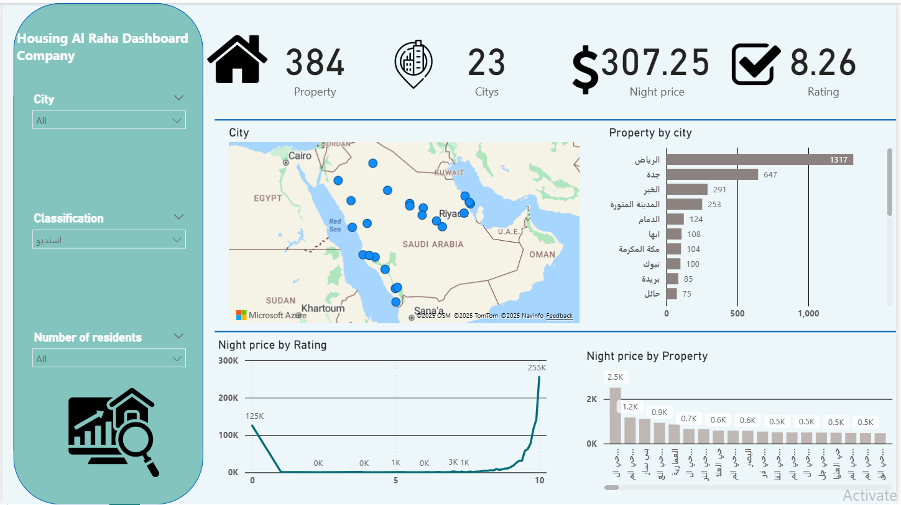

# 🏢 Housing Al Raha Dashboard – Power BI

## 📌 Overview
The **Housing Al Raha Dashboard** provides an interactive analysis of residential property data across multiple cities.  
It enables users to explore property distribution, average night prices, ratings, and classifications through dynamic visuals.

This dashboard is ideal for:
- Real estate analysts  
- Property management companies  
- Tourism and hospitality insights teams  
- Business decision-makers  

---

## 🎯 Objectives
- Analyze total properties across different cities.
- Understand price variations by rating and property type.
- Visualize geographic distribution of properties using an interactive map.
- Compare cities based on total available properties.
- Explore the impact of:
  - City  
  - Property classification  
  - Number of residents  

---

## 🛠 Tools & Skills Used
- Power BI  
- Power Query (ETL & Data Cleaning)  
- DAX Measures  
- Map Visualizations  
- KPI Cards  
- Arabic Localization  
- UI/UX Dashboard Design  

---

## 📁 Dataset Overview
- **Total Properties:** 384  
- **Cities Covered:** 23  
- **Average Night Price:** $307.25  
- **Average Rating:** 8.26  
- **Filters Available:** City, Classification, Number of residents  

---

## 📷 Dashboard Preview

---

## 🔍 Key Insights
- **Riyadh** leads with the highest number of properties (**1317 listings**), followed by **Jeddah** (**647 listings**).
- **Night prices increase significantly with higher property ratings**, peaking at over **255K** for top-rated properties.
- Property distribution is **spread across Saudi Arabia**, with high concentration in major cities.
- Certain regions show **strong correlation** between rating and price, useful for pricing models.
- Property classification (استديو / شقة / غيره) affects price and rating patterns.

---

## 🚀 Features
- Fully interactive filters:
  - City  
  - Classification  
  - Number of residents  
- KPI summary for:
  - Total properties  
  - Number of cities  
  - Night price  
  - Rating  
- Interactive map for property distribution  
- Bar charts comparing cities and property types  
- Line chart showing night price by rating  
- Clean turquoise UI aligned with the dashboard's theme  

---

## 📦 Files Included
- `Housing_Al_Raha.pbix`
- `Housing_Al_Raha.png`
- `README.md`
- `housing_data.csv` *(if included)*

# Housing-Al-Raha-Dashboard-Company
